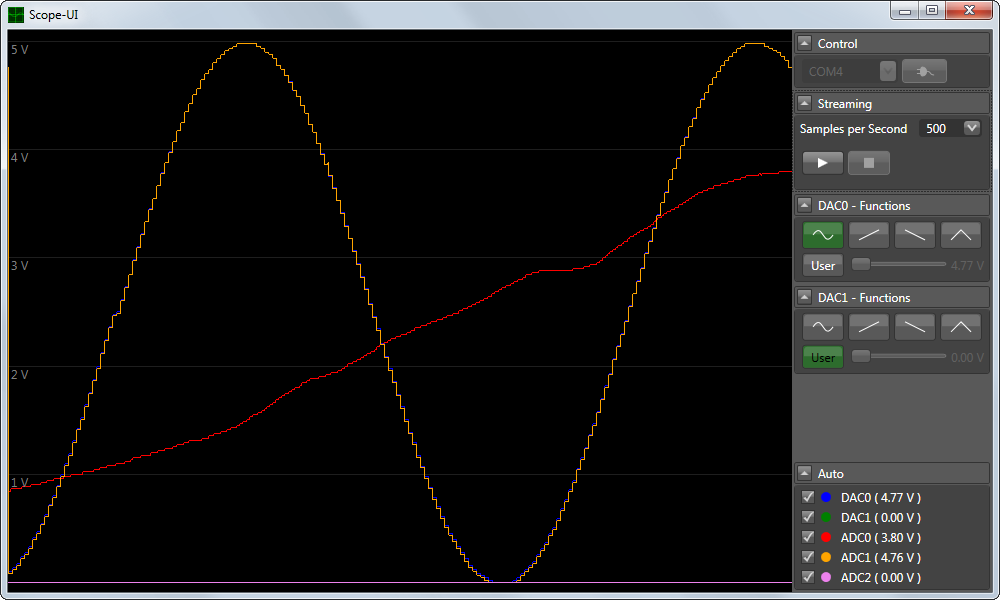

# Scope
Arduino based oscilloscope with controllable DAC and WPF user interface.

## Required hardware
+ Arduino compatible board (Any Arduino or atmega will do)
+ [MCP4902](http://ww1.microchip.com/downloads/en/DeviceDoc/22250A.pdf) SPI-DAC

## Features
+ 4 channels, 8 bit resolution
+ up to 3500 samples per second (per channel)
+ Sine/Saw/Triangle function generator
+ Control the DACs from your PC.

## Setup
+ Connect the 4902 via SPI (default = pin 9, see Hardware.h)
+ Optionally connect a beeper (default = pin 4)
+ Upload the Probe.ino code to the atmega.
+ 3 short beeps will indicate success.
+ Run Scope.exe

## Source code
+ C# 6.0 / WPF / .NET 4.5.2
+ Created with Visual Studio 2015 Community + Visual Micro

## Disclaimer
The project's intention is to visualize slowly changing voltage levels when playing with op-amps.
If you look for a tool to monitor high frequency signals, this might not be the right tool for you.
